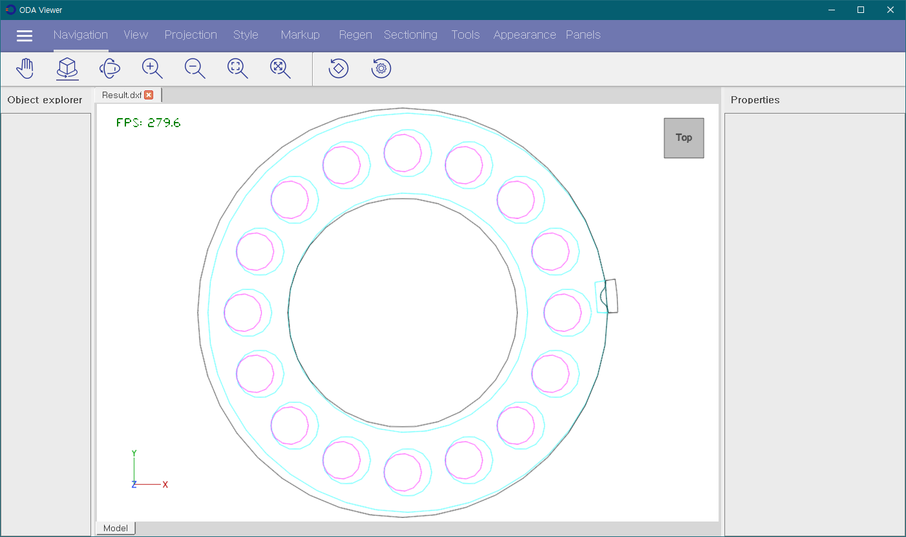
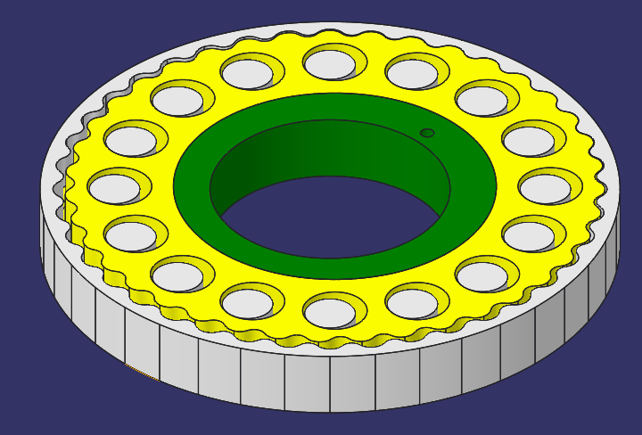

# CRD3
_Cycloidal Eccentric Reducer Designer 3 - with Python3_


## Using on PC

* Install python3 and git
* Install some libraries :

```
pip install numpy
pip install matplotlib
pip install ezdxf
pip install pysimplegui
pip install pandas
```
* Clone this repository by git
* Run :

```
python CRD3.py
```

* GUI :


* Plot :


* Check dxf file :




## Build exe in MS Windows 10

* Development version of pyinstaller is needed because of matplotlib matching issue.

```
pip install https://github.com/pyinstaller/pyinstaller/archive/develop.zip
pyinstaller --icon=CRD3.ico -w -F CRD3.py
```

## Using on Android Device by Pydroid3

* Install [Pydroid3](https://play.google.com/store/apps/details?id=ru.iiec.pydroid3&hl=ko&gl=US) in PlayStore
* Install some libraries by Pip menu in Pydroid3 (numpy, matplotlib, ezdxf, pysimplegui)
* Install [mgit](https://play.google.com/store/apps/details?id=com.manichord.mgit&hl=ko&gl=US) in PlayStore
* Clone this repository
* Load CRD3.py and run
* Save plotting image like that path :

```
/storage/emulated/0/Pictures/DCIM/Screenshots/Figure_1.png
```

## Input parameters

* __m__ : Module (Similar to Involute gear design system)
* __zr__ : Teeth number of Ring gear
* __ze__ : Teeth difference between Ring and Disc
* __h__ : Teeth Height Factor
* __point__ : Control Points for One Tooth
* __X0__ : Center Position
* __Y0__ : Center Position
* __Bearing Size Factor__ : Center Hole Size Factor on Disc
* __Pin Hole Size Factor__ : Pin Hole Size Factor on Disc
* __Bearing Diameter__ : Inner Circle's Diameter of Disc
* __Pin Diameter__ : Pins Diamter
* __Pin Position__ : Radius of Pins' Pitch Circle
* __pins__ : Number of PinsPins


## Reducer Design Example

### with Solidworks

* Applying Top-Down Design Criteria
* Youtube : https://youtu.be/mQp8NB-AJ2k
* Data : `./Example_Solidworks`


### with Creo

* Applying Top-Down Design Criteria
* Data : `./Example_Creo`



## Thank you!